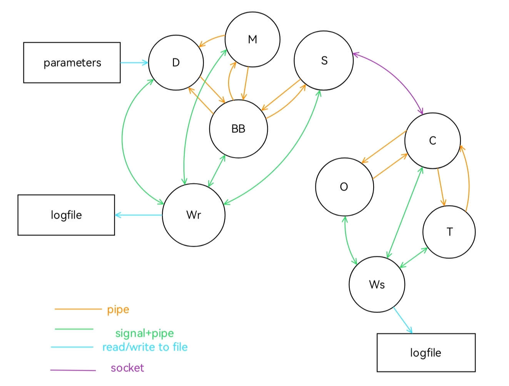

# Basic drone movement simulator, part 3

## Architecture of the software

The software for this simulator is structured as shown in the following picture:

The process architecture shown above can be split in two part. In the first one D is the process responsible of the drone dynamics, BB is the blackboard server and M is the process responsible of displaying the game map and reading the keyboard input, while S is the server and receiver process and Wr is the watchdog process with the task of monitoring the activity of the other 4 processes.
The changeable parameters of the dynamics are stored in the parameters file (*parmeters.txt* file), eventual lack of response from any of the processes is stored in the logfile (*log_results.txt* file).
All 5 processes are started from the Master process (executable of Master.c).
In the second sub-structure O is the obstacle generator process, T is the target generator process, C is the client and sender process while Ws is the watchdog monitoring the other 3 processes. As for the other part of the architecture, all the issues spotted by the watchdog are written on the *log_results.txt* file and all the processes are started by a Master process.

## Processes composing the project

Here is a more detailed description of all the processes.

### comunication between the two part

the two parts composing the overall program can be run on either the same computer or on different ones, thanks to the socket used to connect the sender and receiver processes. To connect they use the port number and host name given as arguments to the *Master*s processes.

### Watchdog

Each one of the two parts has a running watchdog process: their task is the same on either side: they periodically monitor the processes' responses in order to try and detect eventuals locks/crashes; in order to achieve this goal every 2 seconds these processes:

1. send a signal to each of the process it is tasked to monitor;
2. wait a bit to ensure that every process has had the chance to answer to the signal by writing to a specific (named) (log) pipe (one per process);
3. check which processes answered the signal and updates the last response time of each process accordingly, writing on the logfile when a process has not answered one of these calls; it also checks if the map process sent a quit message and, in the case it was sent, ensure that all processes are terminated and then quits;
4. compare the current time with the last response time: if more than 4 seconds of non-response have passed the watchdog register this on the logfile and kill all the children processes, causing the game to end.

### Receiving part

the processes ran in this part focus on simulating, displaying on the screen and storing the values relevant to the simulation and the control of the drone movement

#### Drone dynamics process

The process responsible of the drone's dynamics first reads the parameters from the (editable) *parameters.txt* file structured as follow:

1. force increase unit with each key press (in newton) (current value: 5N);
2. mass of the simulated drone (current value: 0.2 kg);
3. friction coefficient (current value: 0.5 N/(m/s));
4. coefficient modulating the force applied by walls and obstacles to the drone when close enough (current vaue: 40 N/m^3);
5. maximum distance between drone and an obstacle/ a wall to apply a force to the drone (current value : 10 m);
6. coefficient modifying the attractive force applied to the drone by nearby targets (current value : 1 N/m for parabolic-well potential model, 1 N for the conic-well model);
7. threshold for parabolic-well model of forces for targets (current value: 2.5 m);
8. threshold for conic-well model of forces for targets (current value: 5 m).

Then the process runs the following tasks with a frequency of 100 Hz:
1. receives from the map process (using a pipe) the key pressed and processes the corresponding action : if the 'w', 'e', 'r', 'f', 'v', 'c', 'x' or 's' keys are pressed the force applied by the virtual thrusters is increased of one increase unit (input parameter) in the corresponding direction (including diagonal), the 'd' key sets to 0 the forces of the thrusters, the 'z' key restarts the game (placing the drone at the center of the game board) and pressing 'q' makes the processes quit. Any other key (escluding the`ctr+...` keys) received is treated as no key pressed;
2. requests and receives with a pair of pipes (one entering and one exiting the process) the obstacles position if they changed of value from the last interaction between server and dynamics process; 
3. requests and receives with the same pair of pipes the targets position;
4. computes the forces applied by the obstacles (if close enough) to the drone using the Latombe/Kathib's model;
5. computes the forces due to the targets and keeps track of the current target to be reached;
6. if the distance between the drone and the current target is less than 0.5 m the current target to reach is updated, both locally and, through the pipes, on the blackboard;
7. computes, based on the current position of the drone, the force applied by the walls to the drone;
8. from the current and last positions of the drone (stored inside of the process itself) and the sum of the forces the drone is subject to, the next drone position is computed using the euler approximation of the model of the drone; the current and last drone positions are then updated for the next loop iteration;
9. the next drone position is sent to the blackboard using the same pair of pipes.

#### Map dysplayer process

this process is tasked with both showing the obstacles and drone on the simulation window and reading the keyboard input for the drone control. In particular with a frequency of 50 HZ:

1. reads keyboard input and sends it to the dynamics process with a pipe;
2. if the 'z' or 'q' keys have been pressed, a message communicating the reset or quit instruction from the user is sent to the blackboard, then a response from the server is waited in the case of a 'z' key; if the 'q' key was pressed a quit message is also sent to the watchdog (using the log pipe) before quitting itself;
3. requests and receives the current target to reach; then, if all targets have been reached a reset message is sent to the dynamics ('z') and the blackboard ('r') processes;
4. requests and receives the drone position from the blackboard process using a pair of pipes;
5. requests and receives the obstacles' position (if changed) from the blackboard with the pipe pair placed between the two processes;
6. requests and receives the targets' position (if changed) from the blackboard;
7. properly elaborates the obtained coordinates to match with the values required for the ncurses functions to display;
8. updates the display board (on the map the border of the field is white, the current drone position is highlighted with a blue 'X',the obstacles are represented using orange 'O's and the targets are represented by green numbers, to be reached in the order in which they are placed, while the background is black-coloured); both the placement on the display and the colouring are realized using functions from the ncurses library.

#### Blacboard server process

This process stores the drone position and the obstacles'position and communicates with the dynamics, the map and the obstacle generation processes using a pair of (unnamed) pipes per process.
With a frequency of 200 Hz it executes the following actions:

1. checks if any of the processes it communicates with has written a message
2. if there is one message to be read it reads the message and recognises from which process the message came; if more messages simultaneously are to be read, one message (and its correspondong process) is picked randomly;
3. processes the message read and prepares and sends the proper information (based on the content of the message received) to the requesting process (and the other processes if necessary).

Here is a more detailed explanation of point 3:

1. if the requesting process is the drone dynamics:
    - if the first letter is a 'o', the server sends a string containing the number of obstacles stored and theirs coordinates to the process if they changed from the last request; if they didn't change it sends 'n' as an answer message;
    - if the first letter is a 'u', the server extracts the current target to be reached from the message;
    - if the first letter is a 't', the server sends a string containing the target positions if they changed using the same format of the obstacle position message;
    - if the first letter of the message is neither of the 3 previous cases the server unpacks the input message and stores the extracted values as drone coordinates;
2. if the requesting process is the map displayer: 
    - if the first letter of the message is 'd' the server sends the drone position;
    - if the first letter of the message is 'z' or 'r' the server sends an acknowledgement message to the map process and sends to the server/receiver process a reset message ('z') to be sent to the generators processes;
    - if the first letter of the message is 'q' the server sends a quit message ('q') to the receiver process, then quits itself;
    - if the first letter is 'c' the server sends the current target to reach;
    - if the message starts with 'o' the server sends the obstacles' number and cooordinates to the map process;
    - if none of the previous conditions is met the server sends the targets' number and cooordinates to the map process;
3. if the writing process is the server/receiver process (on one of the two pipe pairs connecting them), the server extracts from the message the number of new obstacles (or targets) generated and its coordinates and stores the obtained values (one pie pair is specific for targets, the other one is specific for obstacles).

#### Server/receiving process

This process is tasked with the remote connection to the generators processes using a socket. It generates a socket and waits for a connection with the client process; after a connection it sends the size of the simulation environment and then, with a frequency of 50 Hz:

1. Checks if the Blackboard server sent any messages directed to the generator processes; if there are they are translated to the related messages (check the connection protocol in the *Socket_connection_protocol.pdf* file for further info) and sent to the generators proocesses through the socket;

2. The process checks if any message has been written in the socket from the other end and, if there is, the message is read and sent to the Blackboard server with the pipe corresponding to the generator process the message was first sent from.

### Sending part

This group of of processes is tasked with randomly generating the position of the targets and obstacles used by the receiving end.

#### Obstacle generator process

This process generates periodically new obstacles; the amount of obstacles generated is fixed at 10.
Every second:
1. it checks if there are any messages from the client process; if there are the message is read and its content is analyzed; if the message starts with 'q' the process quits;
2. if a reset message ('z' as first letter) is received it generates and sends to the server a new set of obstacles whith random coordinates. 

#### Target generator process

This process performs the same tasks as the obstacle generator process, but for the targets the drone has to reach (in order). The amount of targets generated when requested is fixed at 5.

#### Client/sender process

This process communicates with the server/receiver process, sending the newly generated obstacles and targets and waiting for reset or quit messages from the receiving end of the program. After a connection this process receives and redirects to the generators processes the size of the environment. Then, with a frequency of 50 Hz:

1. checks for messages from the socket; if there is it is read and: 
    - If a quit message is received a quit message is sent to the generators processes and to the watchdog, then it terminates;
    - If a reset message is received the pipes from the generators are emptied (if they are not already empty) and then a reset message is sent to the generators processes;
2. checks for messages from the generators; if there is a message a character identifying the generator (and the message's contents) (check the conncetion protocol file for further information) is added at the beginning of the message before being sent to the socket.

## How to run and install it

Once you downloaded the folder, first you need to create a folder named `build` inside of the directory in which you downloaded the files (or you can type in the command prompt `$ make start_build`).
once the `build` directory has been created, to compile the source code type in the command prompt:`$ make`
This command is to be executed also if you decided to change something inside the source code (any of the .c files or the worldinfo.h file)
Once that is done to start the simulation the two part must connect successfully. To achieve this first on the receiving part (`receiver` folder) go in the `build` folder and write in the command prompt
`$ ./Master <portno>`, replacing `<portno>` with an appropriate number between 49512 and 65535.
once the processes have been successfully started you need to start the other part of the project by goning in the `sender/build` folder and then typing the prompt `$ ./Master <hostname> <portno>`, where `<portno>` is the same number used on the prompt to run the receiving part and `<hostname>` is the hostname for the machine running the reciever part.
If you modify the parameter.txt file you need to either copy it inside of the `build` folder either using `$ make add_param` (or the standard `cp` linux commands) or recompile the entire project using `$ make`.

## Unistall/ file removal

If you want to remove the binary code and the parameters.txt file from the `build` folder type in the prompt the following command: 
`$ make clean_binaries`
To remove the logfile, instead, write in the terminal: 
`$ make clean_logs`
To remove all the files inside of the `build` folder you can call the two previous commands consecutively or use the command:
`$ make clean`

## Operational instructions

Note: this is written and tested only on the Ubuntu 22.04 OS.

The game makes use of Konsole to display the map: make sure it is installed on the machine running the receiver program before starting the simulation. 

Once the game is up and running, make sure that the simulation window is the selected one, otherwise the key presses will not be read. 

