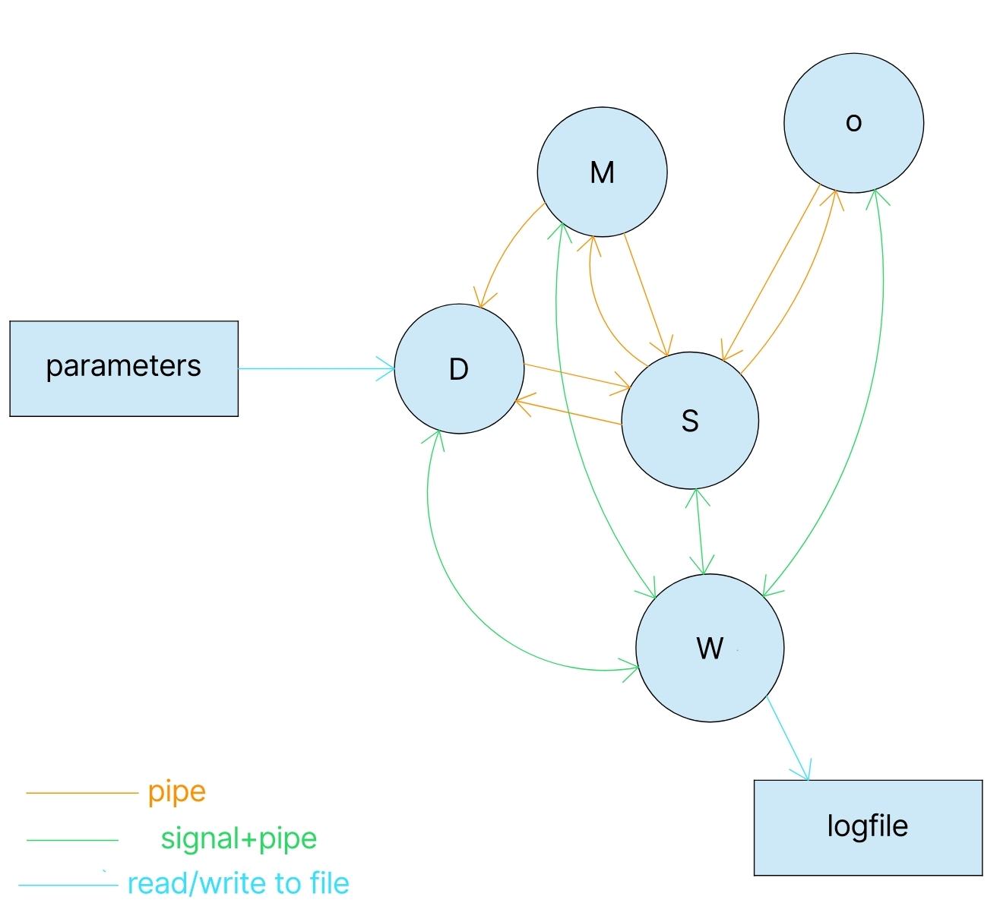

# Basic drone movement simulator, part 2

## Architecture of the software

The software for this simulator is structured as shown in the following picture:

In the above picture D is the process responsible of the drone dynamics, S is the blackboard server and M is the process responsible of displaying the game map and reading the keyboard input, while O is the obstacle generator process and W is the watchdog process with the task of monitoring the activity of the other 2 processes.
The changeable parameters of the dynamics are stored in the parameters file (*parmeters.txt* file), eventual lack of response from any of the processes is stored in the logfile (*log_results.txt* file).
All 3 processes are started from the Master process (executable of Master.c).

## Processes composing the project

Here is a more detailed description of the 5 processes:

### Drone dynamics process

The process responsible of the drone's dynamics first reads the parameters from the (editable) *parameters.txt* file structured as follow:

1. force increase unit with each key press (in newton) (current value: 5N);
2. mass of the simulated drone (current value: 0.2 kg);
3. friction coefficient (current value: 0.5 N/(m/s));
4. coefficient modulating the force applied by walls and obstacles to the drone when close enough (current vaue: 40 N/m^3);
5. maximum distance between drone and an obstacle/ a wall to apply a force to the drone (current value : 10 m);

Then the process runs the following tasks with a frequency of 100 Hz:
1. receives from the map process (using a pipe) the key pressed and processes the corresponding action : if the 'w', 'e', 'r', 'f', 'v', 'c', 'x' or 's' keys are pressed the force applied by the virtual thrusters is increased of one increase unit (input parameter) in the corresponding direction (including diagonal), the 'd' key sets to 0 the forces of the thrusters, the 'z' key restarts the game (placing the drone at the center of the game board) and pressing 'q' makes the process quit. Any other key received is treated as no key pressed;
2. requests and receives with a pair of pipes (one entering and one exiting the process) the obstacle positions if they changed of value from the last interaction between server and dynamics process; 
3. computes the forces applied by the obstacles (if close enough) to the drone using the Latombe/Kathib's model;
4. computes, based on the current position of the drone, the force applied by the walls to the drone;
5. from the current and last positions of the drone (stored inside of the process itself) and the sum of the forces the drone is subject to, the next drone position is computed using the euler approximation of the model of the drone; the current and last drone positions are then updated for the next loop iteration;
6. the next drone position is sent to the blackboard using the same pair of pipes.

### Map dysplayer process

this process is tasked with both showing the obstacles and drone on the simulation window and reading the keyboard input for the drone control. In particular with a frequency of 50 HZ:

1. reads keyboard input and sends it to the dynamics process with a pipe;
2. if the 'z' or 'q' keys have been pressed, a message communicating the reset or quit instruction from the user is sent to the blackboard, then a response from the server is waited in the case of a 'z' key; if the 'q' key was pressed a quit message is also sent to the watchdog (using the log pipe) before quitting itself;
3. requests and receives the drone position from the blackboard process using a pair of pipes;
4. requests and receives the obstacles' position (if changed) from the blackboard with the pipe pair placed between the two processes;
5. properly elaborates the obtained coordinates to match with the values required for the ncurses functions to display;
6. updates the display board (on the map the border of the field is white, the current drone position is highlighted with a blue 'X' and the obstacles are represented using orange 'O's, while the background is black-coloured); both the placement on the display and the colouring are realized using functions from the ncurses library.

### Blacboard server process

This process stores the drone position and the obstacles'position and communicates with the dynamics, the map and the obstacle generation processes using a pair of (unnamed) pipes per process.
With a frequency of 200 Hz it executes the following actions:

1. checks if any of the processes it communicates with has written a message
2. if there is one message to be read it reads the message and recognises from which process the message came; if more messages simultaneously are to be read, one message (and its correspondong process) is picked randomly;
3. processes the message read and prepares and sends the proper information (based on the content of the message received) to the requesting process (and the other processes if necessary).

Here is a more detailed explanation of point 3:

1. if the requesting process is the drone dynamics:
    - if the first letter is a 'r', the server sends a string containing the number of obstacles stored and theirs coordinates to the process if they changed from the last request; if they didn't change it sends 'n' as an answer message;
    - if the first letter of the message is not 'r' the server unpacks the input message and stores the extracted values as drone coordinates;
2. if the requesting process is the map displayer: 
    - if the first letter of the message is 'd' the server sends the drone position;
    - if the first letter of the message is 'z' the server sends an acknowledgement message to the map process and sends to the obstacle generator a reset message ('z');
    - if the first letter of the message is 'q' the server sends a quit message ('q') to the obstacle generator, then quits itself;
    - if none of the previous conditions is met the server sends the obstacles' number and cooordinates to the map process;
3. if the writing process is the obstacle generator process, the server extracts from the message the number of new obstacles generated and its coordinates and stores the obtained values.

### Obstacle generator process

This process generates periodically new obstacles; the possibility of having a variable amount of obstacles generated and simulated is implemented, but for this code the amount of obstacles generated is fixed (10).
Every second:
1. it checks if there are any messages from the blackboard; if there are the message is read; if the message starts with 'q' the process quits;
2. if a reset message ('z' as first letter) was sent or 30 seconds passed from the last obstacle generation, it generates and sends to the server a new set of obstacles whith random coordinates. 

### Watchdog

The task of the watchdog is to periodically monitor the processes' responses in order to try and detect eventuals locks/crashes in the software's processes; in order to achieve this goal every 2 seconds this process:

1. sends a signal to each of the process it is tasked to monitor;
2. waits a bit to ensure that every process has had the chance to answer to the signal by writing to a specific (named) (log) pipe (one per process);
3. checks which processes answered the signal and updates the last response time of each process accordingly, writing on the logfile when a process has not answered one of these calls; it also checks if the map process sent a quit message and, in the case it was sent, ensures that all processes are terminated and then quits;
4. compares the current time with the last response time: if more than 4 seconds of non-response have passed the watchdog registers this on the logfile and kills all the children processes, causing the game to end.

## How to run and install it

Once you downloaded the folder, first you need to create a folder named `build` inside of the directory in which you downloaded the files (or you can type in the command prompt `$ make start_build`).
once the `build` directory has been created, to compile the source code type in the command prompt:`$ make`
This command is to be executed also if you decided to change something inside the source code (any of the .c files or the worldinfo.h file)
Once that is done you can start the simulation by going in the `build` folder and writing in the command prompt
`$ ./Master`.
If you modify the parameter.txt file you need to either copy it inside of the `build` folder either using `$ make add_param` (or the standard `cp` linux commands) or recompile the entire project using `$ make`.

## Unistall/ file removal

If you want to remove the binary code and the parameters.txt file from the `build` folder type in the prompt the following command: 
`$ make clean_binaries`
To remove the logfile, instead, write in the terminal: 
`$ make clean_logs`
To remove all the files inside of the `build` folder you can call the two previous commands consecutively or use the command:
`$ make clean`

## Operational instructions
Note: this is written and tested only on the Ubuntu 22.04 OS.

The game makes use of Konsole to display the map: make sure it is installed before starting the simulation. 

Once the game is up and running, make sure that the simulation window is the selected one, otherwise the key presses will not be read. 

